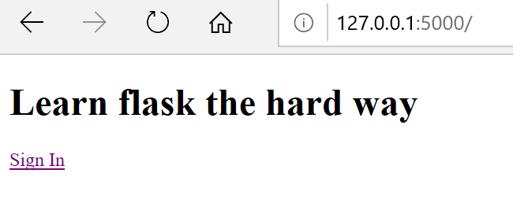
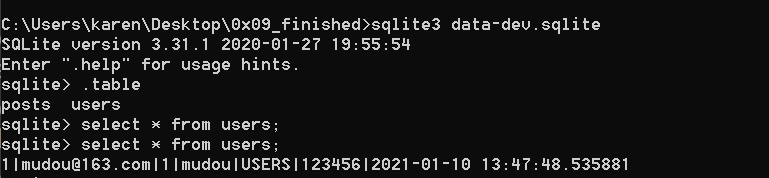

# Digital-media-security-applications-and-practices
大四数字媒体安全应用与实践课程实践作业----flask教程

>code是教师代码基础上更改后的代码

```
# 如果没有安装过 pipenv，请执行以下一条命令完成 pipenv 安装
pip install pipenv

# 安装开发环境所需所有依赖
pipenv install

# 如果在后续代码执行过程中遇到版本兼容性相关错误，可以使用以下命令安装本仓库调试验证过的所有依赖库精确依赖版本
pipenv install --ignore-pipfile

# 进入“纯净”开发环境
pipenv shell
```
## 0x00 _first_project
```
启动Hello World的3种方法
方法 0
python app.py
方法 1
export FLASK_APP=app.py
flask run
方法 2
export FLASK_APP=app.py
python -m flask run
Refs
http://flask.pocoo.org/docs/0.12/quickstart/#quickstart
```
## 0x01_jinja2_templates
使用datatime打印出了当前的时间
## 0x02_WTForms
* 参考文献：[CSRF Protection](https://flask-wtf.readthedocs.io/en/stable/csrf.html)
学习使用WTForms实现登录框以及启用CSRF全局保护。
* 使用了flask_wtf.csrf中的CSRFProtect, CSRFError
* errorhandler（）自定义错误响应
### 运行结果
  
  
### 问题
运行代码时，出现如下图的报错，因此执行```pip install email_validator```解决
    
输入用户名和密码后执行成功。  
  
## 0x03_file_upload
flask实现文件上传
### 运行结果
  
  
  
## 0x04_use_css
使用css模板比如版权信息,使用layout.html。
### 运行结果

## 0x05_use_js
使用了js脚本，Jquery框架
### 运行结果

## 0x06_user_login
必须先登录，已经增加了两个用户的信息。登录后正常使用。
### 运行结果
  
  
## 0x07_sqlalchemy
学习sqlalchemy完成Python与数据库的数据调用。   
```pip install flask_sqlalchemy```   
database.py实现了与数据库的连接和用户登录。
models.py定义了user表，包括Id,email,password。  
使用sqlite3.exe查看数据库example.db,内容如下：  
  
### 运行结果  
根据数据库内用户信息进行登录，然后进入watermark，从而使用。
  
## 0x08_adminlte
```python.exe -m pip install --upgrade pip```更新Pip。   
先使用```conda install -c conda-forge watermark```，再使用```pip install watermark```，才能成功安装。
* 可能会有超时问题 

发现缺了core的blueprint。

### 运行结果

## 0x09_finished
结合[covert_communication](https://github.com/anjingcuc/covert_communication) 
* 0x09_finished中的内容作为服务器
* sender.py 嵌入信息并上传文件。
* receiver.py 下载图片并提取信息。
### 运行结果
1. 初次使用时，更改所有库的地址信息，我打开的是"app"文件夹，因此所有库的位置都删去"app."。后来发现太麻烦，因此删除app文件夹中的"__init__.py",在app同目录下增加manage.py。代码如下图所示：   
  
2. 安装库
```
pip install flask_restful
pip install flask_bcrypt
pip install flask_migrate
pip install flask_migrate
```
3. "AttributeError: 'Marshmallow' object has no attribute 'ModelSchema'"
查看到我的flask_marshmallow版本是0.14.0  

参考['Marshmallow' object has no attribute 'ModelSchema'](https://stackoverflow.com/questions/57984649/marshmallow-object-has-no-attribute-modelschema)队resources/post.py中的代码进行增删改，如下图所示：    

4. 运行成功,出现了用户登录页面。  

使用后出现报错。

发现报错原因是因为没有建表，而此时在config.py同目录下多出了数据库'data-dev.sqlite'

5. 使用sqlite3.exe进行建表和增删改数据的操作。  
  
一开始查看确实没有user表,也没有数据。

发现每一次创建的数据库都是临时的，也就是使用sqlite3从后端操作数据是不可能的，只能从代码的角度进行更改。然而user/models.py里面关于user表的创建是写好的。参考[sqlalchemy.exc.OperationalError: (sqlite3.OperationalError) no such table](https://stackoverflow.com/questions/44941757/sqlalchemy-exc-operationalerror-sqlite3-operationalerror-no-such-table/44944205)在application.py中进行更改，如下图所示：  

再次查看新的数据库，发现创建表成功。  

6. 更改application.py增加用户信息.
* 参考[sqlalchemy.exc.IntegrityError: (sqlite3.IntegrityError) UNIQUE constraint failed: users.login](https://stackoverflow.com/questions/39288538/sqlalchemy-exc-integrityerror-sqlite3-integrityerror-unique-constraint-failed)j解决'sqlalchemy.exc.IntegrityError: (sqlite3.IntegrityError) UNIQUE constraint failed: users.email'

如下图所示：     
   
* 错误设置：  
   
这样会导致密码没有进行加盐运算

运行后再看数据库中确实多了一行用户信息。  
  
7. 使用sender.py和receiver.py
```
pip install bs4
pip install opencv-python
pip install pathlib
```
在sender.py中增加信息。  

运行sender.py以后看到同目录文件夹下多了embed.jpg
  
看到0x09/instance/upload文件夹下（服务器端）多了图片
 
8. 运行receiver.py,输出水印的文本："hello,world!"  

* 由于posts是个三维数组，因此更改receiver.py的代码，如下图所示：  
  
再执行就能下载所有的图片

## 参考文献
[learn_flask_the_hard_way)](https://github.com/anjingcuc/learn_flask_the_hard_way)  
[covert_communication](https://github.com/anjingcuc/covert_communication)  
[flask mannual](https://flask.palletsprojects.com/en/1.1.x/)


